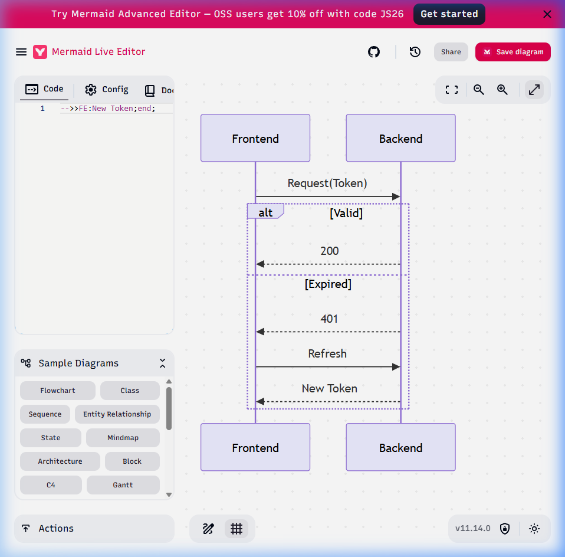
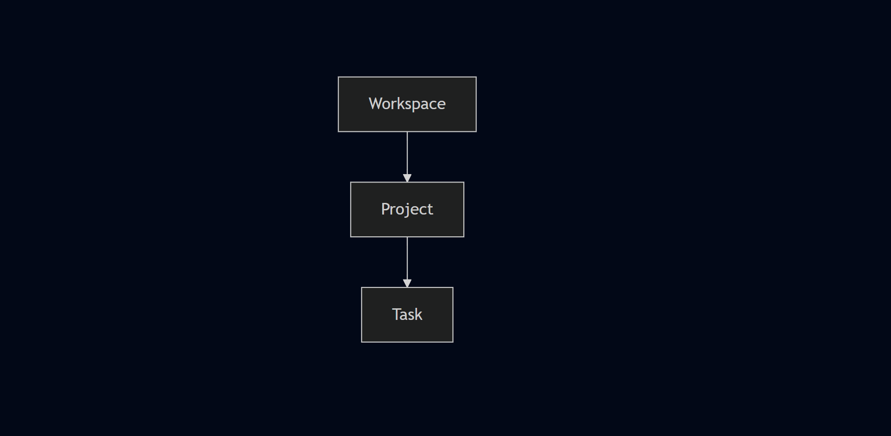
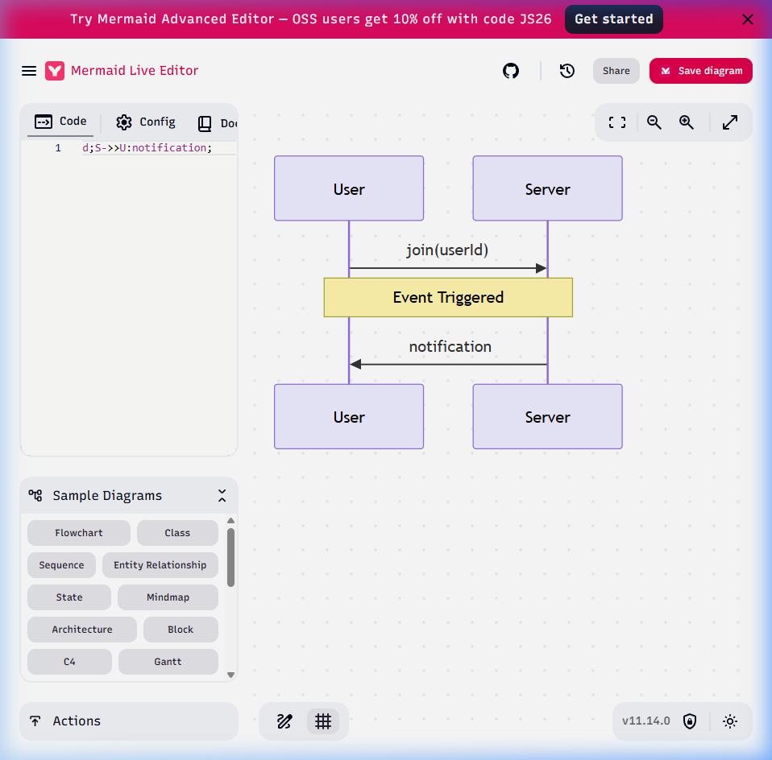

# 🗺️ Frontend Integration & Flow Guide

This document explains how to integrate your frontend with the SaaS Backend correctly.

## 🚀 Visual Flowcharts

### 1. Authentication & Token Security Flow

---

### 2. Multi-Tenant Navigation Hierarchy

---

### 3. Real-time Notification System

## 💡 Frontend Architecture Tips:
1.  **Global Context**: Keep `activeWorkspaceId` and `activeProjectId` in your state manager (Redux/Zustand/Vuex).
2.  **API Interceptor**: Use **Axios Interceptors**. Use one for adding the `Bearer` token to every call, and another one (response interceptor) to catch 401 errors and trigger the refresh flow automatically.
3.  **Unified Post**: Remember that creating a task uses `multipart/form-data`. Ensure your frontend `fetch` or `axios` call handles the `FormData` object correctly.

---
*This guide ensures parity between backend logic and frontend implementation.*
